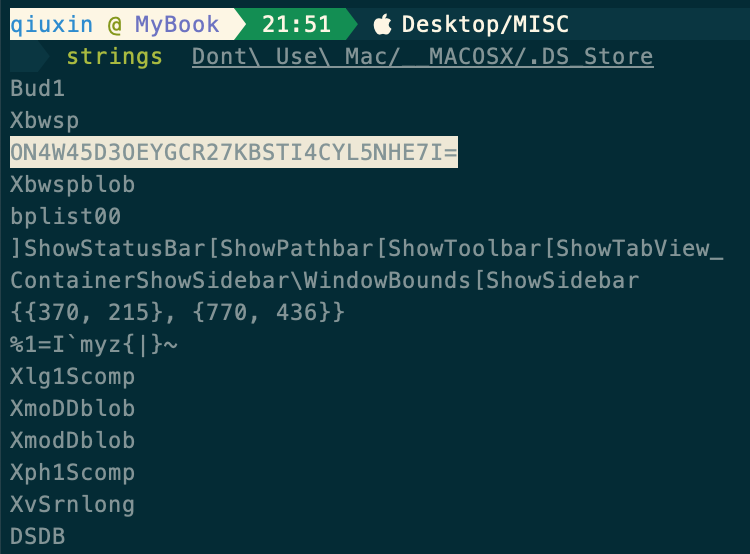
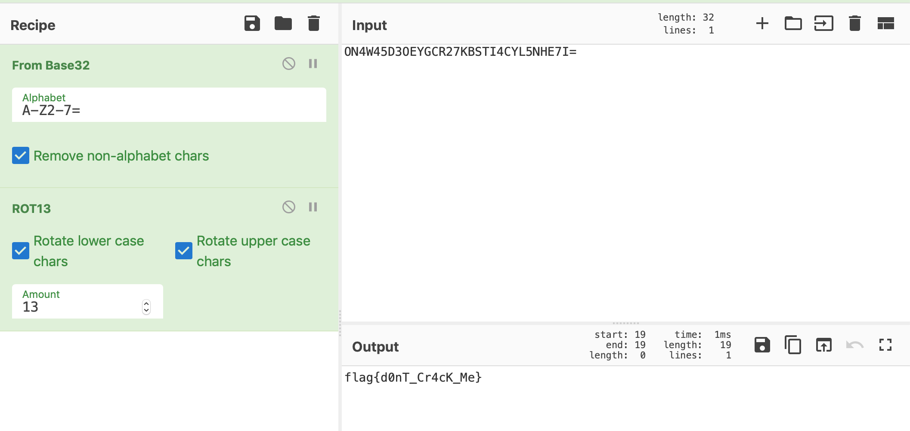

# Don't Use Mac

解压缩包发现有一个文件夹和一张图片，图片里藏了压缩包，但实际上这里是误区，真正的flag是藏在`__MACOSX`文件夹下，这个文件夹通常是在解压缩的时候会存在，`__MACOSX` 中的`.DS_Store`里存在可疑字符串,通过Base32+ROT13即可得到答案。这里要注意的是，Mac上在解压缩的时候会在建立文件夹的时候覆盖掉`.DS_Store`，这也是题目名字的暗示。

