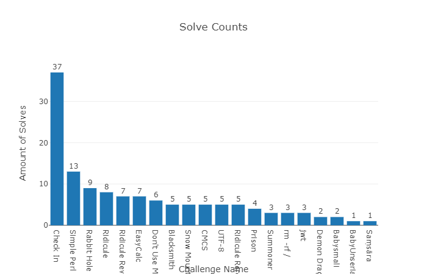

# MetasequoiaCTF

本次比赛是Metasequoia战队队内新人赛，因此题目非常简单。

- 题型：Web、Pwn、Misc、Crypto、Reverse
- 赛制：线上个人解题赛
- 时间：2020/2/20 13:00 - 2020/2/21 17:00
- 如无特别说明，web题flag默认位于/flag，pwn题flag默认位于/pwn/flag
- 感谢[H1ve项目](https://github.com/D0g3-Lab/H1ve/)对本次比赛的支持

## 题目
- Web
  - Simple Perl (by ice-cream)
  - EasyCalc (by ice-cream)
  - UTF-8 (by Mercurio)
  - jwt (by Mercurio)
  - BabyUnserialize (by ice-cream)
- Pwn
  - Blacksmith (by Mercurio)
  - Snow Mountain (by Mercurio)
  - Summoner (by Mercurio)
  - Demon Dragon (by Mercurio)
  - Samsara (by Mercurio)
- Misc
  - Check In (by FLAG挖掘机)
  - Don't Use Mac (by FLAG挖掘机)
  - Rabbit Hole (by Yoshino-s)
  - rm -rf / (by FLAG挖掘机)
- Crypto
  - Ridicule (by Mercurio)
  - Ridicule Revenge (by scholze)
  - Ridicule Rerevengevenge (by scholze)
- Reverse
  - CMCS (by Mercurio)
  - Babysmali (by Mercurio)
  - Prison (by Mercurio)
