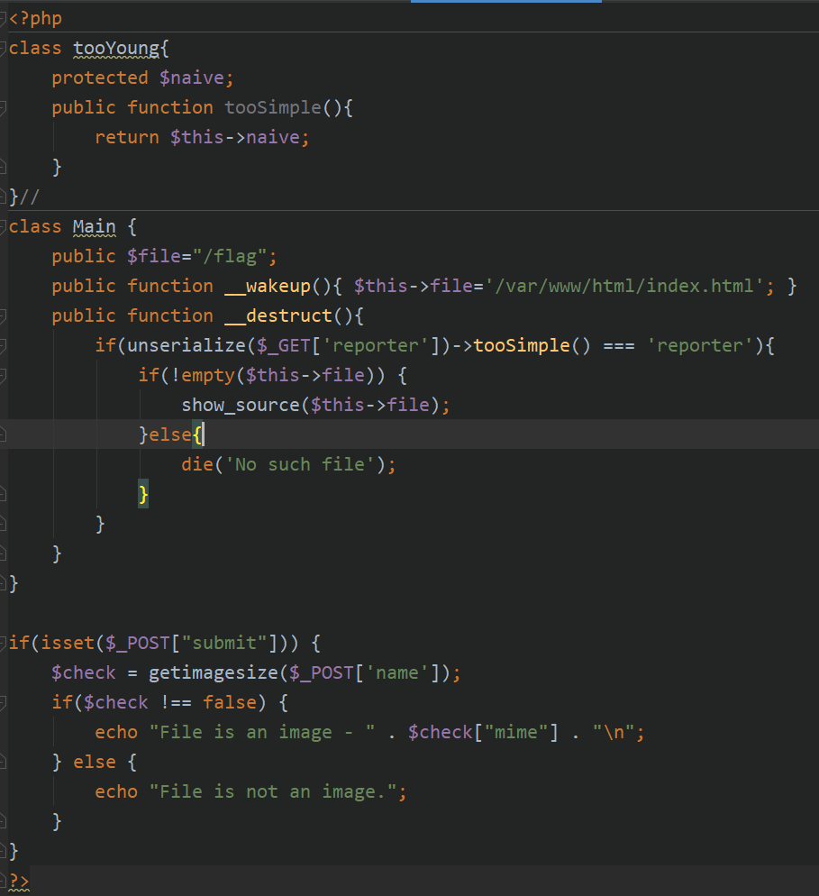
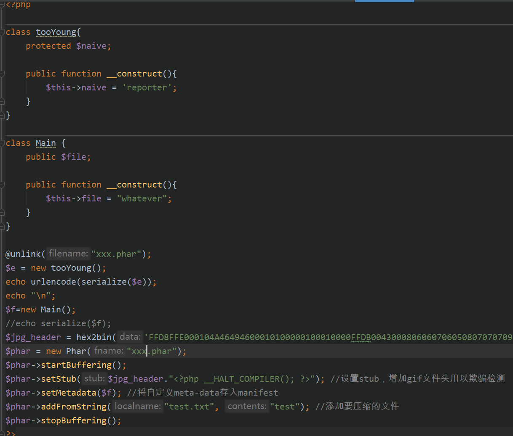
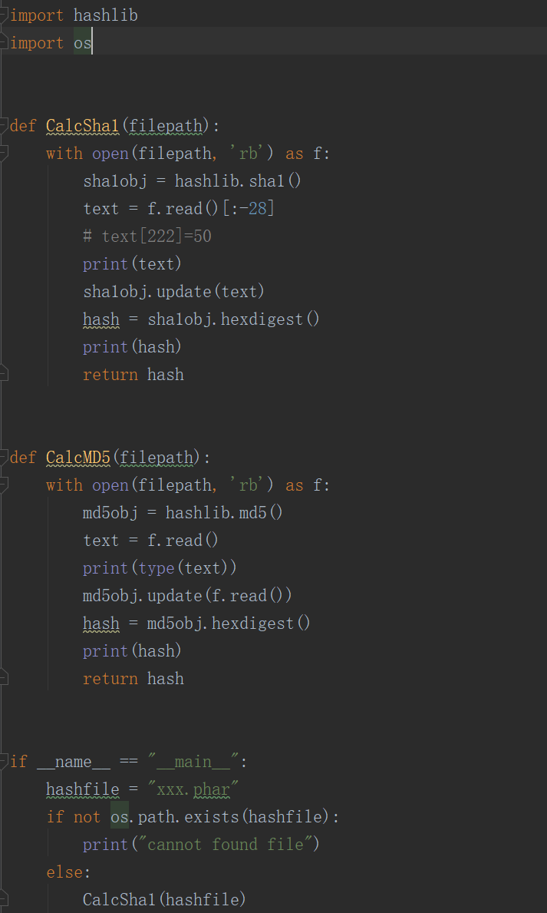
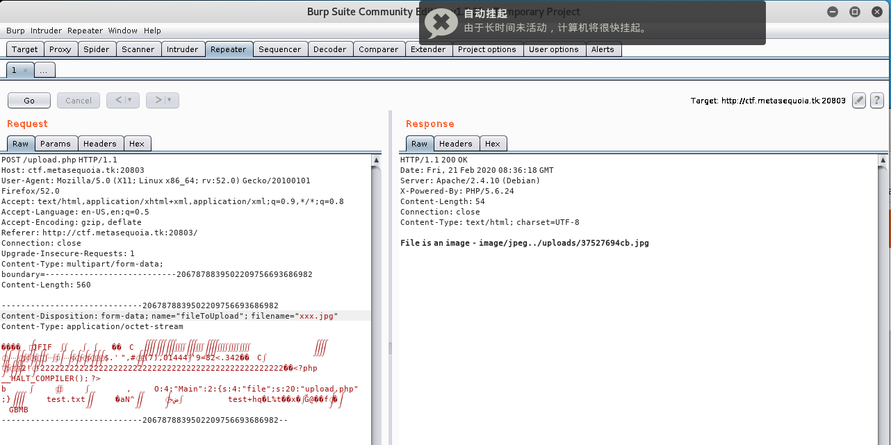
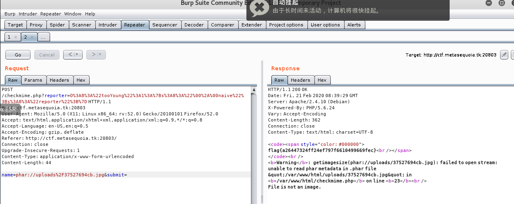

# BabyUnserialize

打开网页源码发现提示有swp文件泄露。

尝试了一下几个post的网页，发现有`.checkmime.php.swp`泄露：

根据源码，看到`getimagesize`知道能触发phar反序列化。

上传构造好的phar包，发现首先要过一个`get`的反序列化，其次要绕过`__wakeup`。

绕过`__wakeup`的方式是更改反序列化后的元素数量，这个是保存在phar包里的元数据，需要更改。

这里有个考点是php默认phar是需要签名的，如果签名错误会报错，所以在phar包里改数据是需要重新签名的，根据phar的标准，倒数28个字节到倒数8字节的区间里是签名，将前面的内容一起用sha1函数签名，覆盖原签名。

以下Phar包wp：

以下是计算签名wp：

上传phar包：

得到图片的地址，再带入到`checkmime`中查询图片类型，同时将地址改为phar伪协议，还有加上`reporter`的`get`过`if`判断。

得到flag，这里就不讲phar反序列化了。